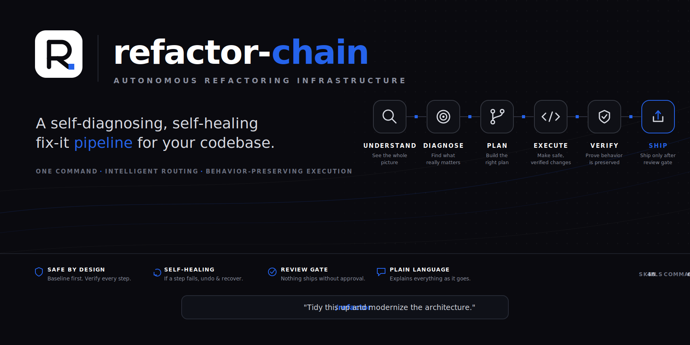

<p align="center"></p>

# refactor-chain


**A self-diagnosing, self-healing fix-it pipeline for your codebase — one door in, safe changes out.**

> **By [Ahmed "Ben" Zayed](mailto:zayed@zat.vc)** — Head of Products & Ventures at ZAT.VC · Venture Partner

refactor-chain looks at a codebase, works out what it actually needs — tidy the
structure, modernize it, fix a bug, or make the UI better — and routes the job to
the right lane of **57 native `refactor-*` skills**. It takes a baseline before
it touches anything, proves behavior is preserved at every single step, runs a
review gate before it lets the work "ship," and explains the whole thing in plain
language as it goes. If a step goes wrong it undoes it and tries another way (up to
three times) instead of leaving you with a broken repo. You drive it through one
door — `/refactor`, `/fix`, `/check` — and it figures out the rest.

---

## Install — the universal wizard (recommended)

One line. It auto-detects everything and installs to each surface it finds.

**macOS / Linux:**

```sh
curl -fsSL https://raw.githubusercontent.com/ahmedbenaw/refactor-chain/main/install.sh | sh
```

**Windows (PowerShell):**

```powershell
irm https://raw.githubusercontent.com/ahmedbenaw/refactor-chain/main/install.ps1 | iex
```

**What the wizard does**

| | |
|---|---|
| 🔍 **Detects** | every AI-coding surface on your machine — no flags needed |
| 📦 **Installs** | skills, commands, and hooks to each one, with backups |
| ✅ **Verifies** | each install, then proves the plugin answers |
| 🩺 **Self-troubleshoots** | missing Node, malformed settings, hook-path issues |

**Supported surfaces**

> **Agents** · Claude Code · Claude Cowork · Codex
> **Editors** · Cursor · VS Code + Copilot · Windsurf · Zed · Cline · Roo · Continue · Gemini CLI · aider · opencode · Amp

**Zero prerequisites** — the shell core needs only `sh` + `curl`/`wget`
(macOS/Linux) or built-in PowerShell (Windows). All OS defaults; nothing to
install first.

**Handy flags:**

- `--dry-run` — detect and show the plan, install nothing.
- `--only <ids>` — only these surfaces, e.g. `--only claude-code,cursor`.
- `--skip <ids>` — everything except these.
- `--uninstall` — remove refactor-chain from every surface (restores backups).
- `--yes` — non-interactive. `--details` — verbose/technical output.

**No-runtime machines?** Two fallbacks share the exact same install contract:

- **`rcx.mjs`** — a Node wizard (`node rcx.mjs`) for a nicer interactive face.
- **Go binary** — a single self-contained executable from the
  [Releases page](https://github.com/ahmedbenaw/refactor-chain/releases) for
  machines with no Node and no shell you trust. Download, run, done.

---

## Install per surface

Prefer to do it by hand? Every surface has a manual path.

<details>
<summary><b>Claude Code &amp; Claude Cowork</b> (they share <code>~/.claude</code>)</summary>

Installing to Claude Code covers Cowork too — both read `~/.claude`. The installer
copies `skills/*` → `~/.claude/skills/`, `commands/*` → `~/.claude/commands/`, the
orchestrator scripts → `~/.claude/skills/refactor-chain/scripts/`, and registers
the 6 hooks in `~/.claude/settings.json` (using space-free absolute paths).

**macOS / Linux:**
```sh
curl -fsSL https://raw.githubusercontent.com/ahmedbenaw/refactor-chain/main/install.sh | sh -s -- --only claude-code
```

**Windows (PowerShell):**
```powershell
& ([scriptblock]::Create((irm https://raw.githubusercontent.com/ahmedbenaw/refactor-chain/main/install.ps1))) --only claude-code
```
</details>

<details>
<summary><b>Codex</b> (<code>~/.codex</code>)</summary>

Copies the whole plugin → `~/.codex/plugins/refactor-chain/` and merges the 6 hooks
into `~/.codex/hooks.json`.

**macOS / Linux:**
```sh
curl -fsSL https://raw.githubusercontent.com/ahmedbenaw/refactor-chain/main/install.sh | sh -s -- --only codex
```

**Windows (PowerShell):**
```powershell
& ([scriptblock]::Create((irm https://raw.githubusercontent.com/ahmedbenaw/refactor-chain/main/install.ps1))) --only codex
```
</details>

<details>
<summary><b>Any editor</b> (Cursor / VS Code+Copilot / Windsurf / Zed / Cline / Roo / Continue / Gemini CLI / aider / opencode / Amp)</summary>

Installed via the `skills` CLI. Swap `<agent>` for your editor's id:
`cursor` · `github-copilot` (VS Code) · `windsurf` · `zed` · `cline` · `roo` ·
`continue` · `gemini-cli` · `aider-desk` · `opencode` · `amp`.

**macOS / Linux / Windows** (needs Node/npx):
```sh
npx -y skills@latest add ahmedbenaw/refactor-chain --global --agent <cursor|github-copilot|windsurf|zed|cline|roo|continue|gemini-cli|aider-desk|opencode|amp> --copy --full-depth
```
</details>

---

## Usage

There's really one door. Describe what's wrong in plain words and let it route.

> 📖 **Full usage guide → [docs/USAGE.md](docs/USAGE.md)** — every one of the
> 70 commands with examples, worked use cases, and macOS / Linux / Windows notes.

| Command | What it's for |
|---------|---------------|
| `/refactor` | The main door. "Tidy this up," "modernize this," "make it better." Detects the lane and runs the chain. |
| `/fix` | Something broke. "The login button does nothing," "this crashes on save." |
| `/check` | Review before you ship. "Is this safe to merge?" |
| `/refactor-status` | "Where are we? What's done, what's next?" |
| `/refactor-undo` | Roll back the last step. Undo is always one step away. |
| `/refactor-resume` | Pick up a run that paused (after a restart or compaction). |
| `/refactor-stop` | Stop cleanly, keep what's verified so far. |
| `/refactor-careful` | Force careful mode — asks before every change. |
| `/refactor-autopilot` | Force autopilot — runs the whole chain, pausing only at the review gate. |

**Plain-language examples:**

- `/refactor` — "This Java service is a mess, clean up the architecture."
- `/fix` — "Uploading a file silently fails — figure out why and fix it."
- `/check` — "I'm about to open a PR, is this behavior-preserving?"
- `/refactor-ui-visual` — "Make this screen look less cramped."

**Three modes:**

- **careful** — one step, one decision at a time; asks before anything risky.
- **autopilot** — runs end to end, stopping only at the review gate.
- **ask-once** — agrees the plan up front, then proceeds without re-asking each step.

Want the depth? Say **"show technical details"** at any point and it drops the
plain-language voice for the exact commands, diffs, and rule references.

---

## What's inside

**Lanes** (the pipeline picks one based on what it detects):

- **backend** — 9 ordered, registry-driven layered-governance steps (any stack whose
  registry entry says `lane: "backend"` — Java, Kotlin, Scala, C#, …): architecture →
  module-rename → dao-model → service → controller → dependency-guard → api-naming →
  common-extract → code-optimize.
- **web** — 5 ordered steps: structure → modules → components → layout → naming.
- **ui** — visual polish: hierarchy, typography, color, layout, components, tokens,
  a11y, mobile.
- **code** — the principle-driven structural pass (`refactor-code-principles`, appended to
  every lane as the final consolidating step).
- **debug** — the `/fix` lane: reproduce → localize → fix → prove.

### The pipeline

```
UNDERSTAND → DIAGNOSE → PLAN → BASELINE → DO-THE-WORK → SECURE/REVIEW → DOCS → SHIP → IMPROVE
```

### Languages — registry-driven, extensible by a data edit

| Family | Covered |
|---|---|
| **JS/TS** | JavaScript · TypeScript · Node · Bun · Deno · WebAssembly |
| **JVM** | Java · Kotlin · Scala (Spring, Quarkus, Android, …) |
| **BEAM** | Erlang · Elixir (OTP, Phoenix, Nerves) |
| **Systems** | C · C++ · Rust · Zig · Ada/SPARK |
| **.NET / Windows** | C# · VB/Basic · Delphi/Object Pascal |
| **Apple / mobile** | Swift · Objective-C · Dart/Flutter |
| **Scripting** | Python · Ruby · PHP · Perl · Lua · Shell · curl · R · MATLAB |
| **Functional / logic** | Haskell · OCaml/Caml · Lisp · Prolog · Wolfram |
| **Legacy / enterprise** | COBOL · Fortran |
| **Data / infra** | SQL · Nix · Go |

…and more — adding a language is a **data edit** in `scripts/lib/languages.mjs`, not code.

### By the numbers

| | |
|---|---|
| 🧩 **Skills** | 57 native `refactor-*` skills across 5 lanes (plus a cross-lane review board) |
| ⌨️ **Commands** | 70 plain-language slash commands |
| 🪝 **Hooks** | 6 — resume · intake · risk-guard · self-heal · ship-gate · memory — all dormant unless a chain is active |
| 🛡️ **Contract** | behavior-preserving, checkpoint before every step, undo always one step away |

---

## GitHub Action

Get a refactor-readiness report on every pull request — report-only; it never
edits, pushes, or merges:

```yaml
- uses: ahmedbenaw/refactor-chain@v4
```

The default **deterministic** mode runs only the zero-dependency analysis
scripts (classify + guidelines audit + doctor) and publishes a ranked report
to the job summary (optionally as a PR comment with `comment: true`).

Opt-in **agent mode** additionally pipes a bounded, read-only review prompt to
your own agent CLI — your command, your credentials, never the action's:

```yaml
- uses: ahmedbenaw/refactor-chain@v4
  with:
    mode: agent
    agent-cmd: "<your-agent-cli>"   # e.g. "claude -p" or "codex exec" — runs with YOUR credentials, in YOUR repo
```

---

## Decision checkpoints

The pipeline asks you multi-choice questions **mid-run, at the moment of the fork** — never batching decisions to the end: mode pick, lane clarify, principle selection, pre-risky-step confirmation, gate-finding triage (fix now / defer / accept), scope-drift flags (pursue or park), and spec-vs-code conflicts. In Claude surfaces these render as native choice UI; everywhere else as numbered options. Autopilot reduces how often you're asked but **never** removes checkpoints before destructive actions. Every answer is recorded in state and echoed in the write-up.

Platforms covered by detection include web, mobile, desktop, backend, CLI, monorepo, and **embedded** (PlatformIO / Zephyr / Arduino / cross-toolchain CMake — routed to the code lane with host-runnable-tests guidance). See `node scripts/diagnose.mjs matrix` for the full matrix.

## How it stays safe

- **Baseline first.** Before it changes anything, it captures the current state (a
  checkpoint it can roll back to).
- **Verify after every step.** Step N+1 never starts until step N proves behavior is
  preserved. It's a hard chain, not a wishlist.
- **Review gate + Stop hook.** A run can't "ship" until it passes the review gate;
  the `Stop` ship-gate hook enforces it.
- **Self-heal, bounded.** If a step fails it undoes the change and tries another way,
  up to **3 attempts**, then pauses and asks — never a raw stack trace.
- **Never on a red repo.** It won't start refactoring a codebase that's already
  broken (failing build/tests) — it tells you to get to green first.
- **Behavior-preserving.** Refactoring changes *how* the code is written, never *what
  it does*. (The `/fix` lane is the one place a behavior change is the goal — and it
  proves the fix.)

---

## Uninstall

```sh
# macOS / Linux
curl -fsSL https://raw.githubusercontent.com/ahmedbenaw/refactor-chain/main/install.sh | sh -s -- --uninstall
```
```powershell
# Windows
& ([scriptblock]::Create((irm https://raw.githubusercontent.com/ahmedbenaw/refactor-chain/main/install.ps1))) --uninstall
```

It removes the skills, commands, and plugin dirs from each surface, strips the hook
entries, and restores the `settings.json` / `hooks.json` backups it made.

---

## Requirements

- **Nothing** for the shell core — POSIX `sh` + `curl`/`wget` (macOS/Linux) or
  PowerShell + `Invoke-WebRequest` (Windows) are OS defaults.
- **Node 18+** only for the plugin's runtime scripts (the orchestrator + hooks) and
  the optional `rcx.mjs` wizard. The installer can bootstrap Node for you via your
  package manager when a surface needs it; the **Go binary** needs nothing at all.

---

## claude.ai note

claude.ai is a hosted surface with no local filesystem — this installer can't reach
it. Add refactor-chain there through the **Connector / settings UI** in claude.ai,
not via `install.sh`.

---

## License

MIT — see [LICENSE](./LICENSE).

---

Built by [Ahmed "Ben" Zayed](mailto:zayed@zat.vc) — Head of Products & Ventures at ZAT.VC [Venture Partner]
